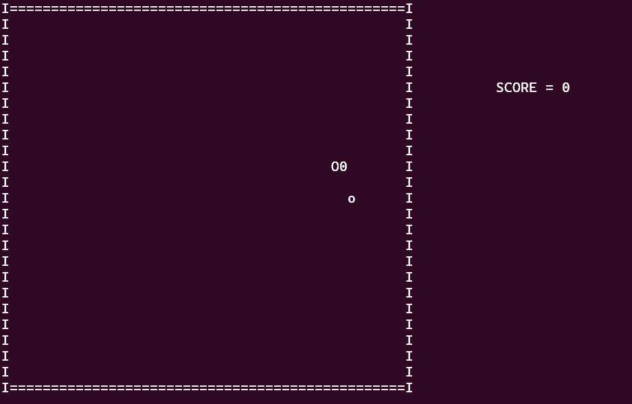

# C++ Console Snake Game

A classic implementation of the Snake game that runs directly in the command-line interface, built from scratch using C++.



## Description

This project is a console-based version of the classic Snake game. The objective is to control the snake to eat the fruit that appears at random locations. Each time the snake eats, it grows longer. The game ends if the snake collides with its own body. This project was developed to demonstrate a solid understanding of fundamental programming principles and C++ development without relying on external game libraries.

## Features

- **Classic Gameplay:** Core mechanics of the original Snake game.
- **Dynamic Growth:** The snake grows in length after consuming fruit.
- **Collision Detection:** The game ends upon collision with the wall or the snake itself.
- **Score Tracking:** Keeps track of the fruit eaten.
- **Flicker-Free Rendering:** Uses efficient console clearing and drawing techniques for a smooth visual experience.

## How to Play

### Prerequisites

You will need a C++ compiler (like g++) installed on your system.

### Compilation

1.  Clone the repository to your local machine:
    ```bash
    git clone https://github.com/Muhammad-Barbary/Console_Snake
    ```
2.  Navigate to the project directory:
    ```bash
    cd Console_Snake
    ```
3.  Compile the source code using g++:
    ```bash
    g++ main.cpp -o snake
    ```

### Running the Game

Execute the compiled binary:

```bash
./snake

### Running the Game

Execute the compiled binary:

```bash
./snake
```

### Controls

* **W**: Move Up
* **A**: Move Left
* **S**: Move Down
* **D**: Move Right

## Technical Stack

* **Language**: C++

## License

This project is licensed under the MIT License. See the `LICENSE` file for details.

